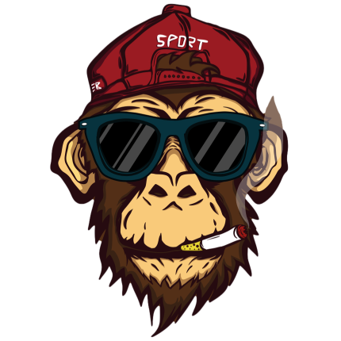

<div id="top"></div>

[![LinkedIn][linkedin-shield]][linkedin-url]

<!-- PROJECT LOGO -->
<br />
<div align="center">
  <a href="https://github.com/ahmetkoprulu/okkes">
    
  </a>

<h3 align="center">ökkeş</h3>

  <p align="center">
    Ökkeş is experimental general purpose discord bot.
    <br />

<button onclick="window.location.href='https://discord.com/api/oauth2/authorize?client_id=427520954294599680&permissions=8&scope=bot%20applications.commands';" style="background: #783f04;
background: linear-gradient(#783f04, #b45f06);
border-radius: 11px;
border: 0px;
padding: 15px 25px;
color: #ffffff;
display: inline-block;
font: normal bold 20px/1 'Open Sans', sans-serif;
text-align: center;"><i class="fab fa-discord"></i> Add To Discord</button>

  </p>
</div>

<!-- TABLE OF CONTENTS -->
<details>
  <summary>Table of Contents</summary>
  <ol>
    <li>
      <a href="#about-the-project">About The Project</a>
      <ul>
        <li><a href="#built-with">Built With</a></li>
      </ul>
    </li>
    <li>
      <a href="#getting-started">Getting Started</a>
      <ul>
        <li><a href="#prerequisites">Prerequisites</a></li>
        <li><a href="#commands">Commands</a></li>
      </ul>
    </li>
    <li><a href="#license">License</a></li>
  </ol>
</details>

<!-- ABOUT THE PROJECT -->

## About The Project

Ökkeş is responsible for the automations i usually need while using discord actively. it uses discord.js v13 and heavily based on (/) commands. Also, voice control will be added in the future.

### Built With

- [Node](https://nextjs.org/)
- [Discord.js](https://reactjs.org/)
- [FFMPEG](https://vuejs.org/)

<!-- GETTING STARTED -->

## Getting Started

To get a local copy up and running follow these simple example steps.

### Prerequisites

Ökkeş uses `dotenv` module to store the project variables. In order bot to work, it needs two variable in the `.env` file

- `TOKEN_ID` is the token which can be generated or displayed on the `Discord Developer Portal` > `Bot` page.

- `CLIENT_ID` is the id which is assigned to your bot by Discord. You can display it on `Discord Developer Portal` > `General Informartion` page

Running ökkeş for development is so simple. Ökkeş has hot-reloading since running with `nodemon`. Therefore, no need to run these steps every time you made changes.

- In order to install all the dependencies run
  ```sh
  npm install
  ```
- In order to build js file you can run
  ```sh
  npm build
  ```
- When you add/remove new commands and force to update discord to display them, you can run the reload command.
  ```sh
  npm run reload-commands
  ```
- You can simply run the command below to start development
  ```sh
  npm run dev
  ```

### Deployment

- **Heroku**
  The project is Heroku ready. Since `build` and `postinstall` scripts exist, any node js dyno will handle the deployment.
- **Docker**
  Dockerfile included in the project therefore all you need to do is creating docker image by using the command `docker build -t okkes .` then running the image by ` docker run -d --name=okkes-bot okkes`.

### Commands

- **/play** `text:string`
  Plays the song from the url. Option could be either in url format or set of key words.
- **/loop**
  Loops the current song.
- **/queue**
  Displays the music queue users in the voice channel played.

- **/skip**
  Skips to the next song in the queue.

- **/pause**
  Pauses the music player if it is playing music.

- **/resume**
  Resumes the music player if it is paused.

- **/ping**
  Responds with pong in order check the bot running healthy.

- **/disconnect**
  Disconnects ökkeş from the voice channel currently it is in.

<!-- LICENSE -->

## License

Distributed under the MIT License. See `LICENSE.txt` for more information.

<!-- MARKDOWN LINKS & IMAGES -->
<!-- https://www.markdownguide.org/basic-syntax/#reference-style-links -->

[linkedin-shield]: https://img.shields.io/badge/-LinkedIn-black.svg?style=for-the-badge&logo=linkedin&colorB=555
[linkedin-url]: https://www.linkedin.com/in/ahmetkoprulu/
